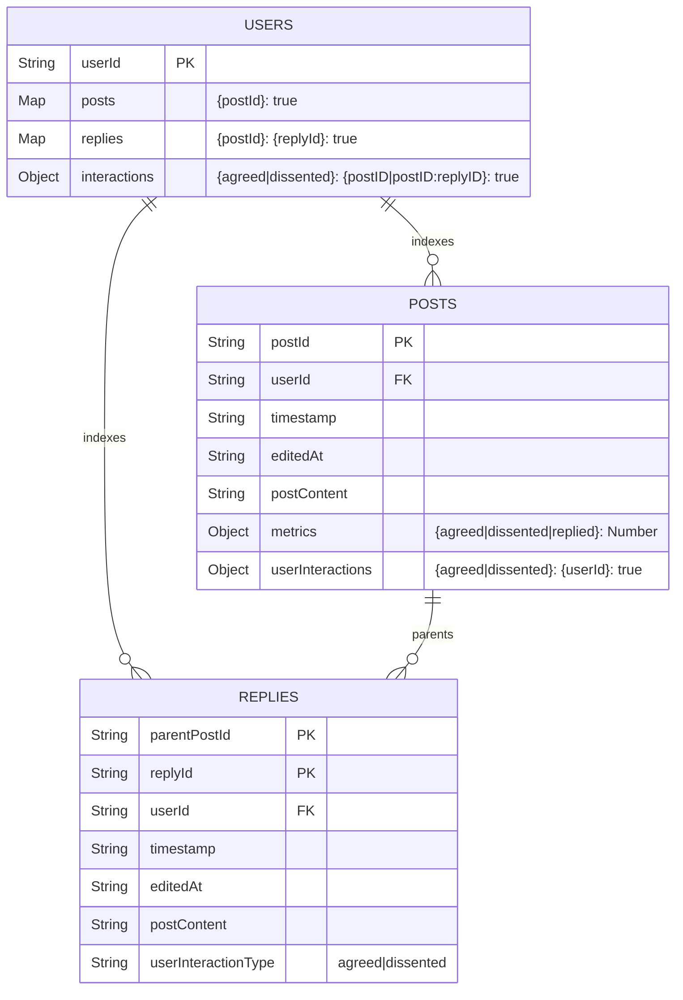

# The Open Dissent

## Development Setup

Install dependencies and start the frontend:

```sh
pnpm i # Install dependencies
```

In another terminal...

```sh
pnpm functions:watch # compile backend functions
```

In another terminal...

```sh
pnpm dev # start frontend
```

In yet another terminal...

```sh
# IF YOU HAVEN'T RAN THIS BEFORE, USE THE FOLLOWING
pnpm emulate:new # start backend (local emulator dev environment)

# AFTER FIRST USAGE, USE THE FOLLOWING
pnpm emulate # start backend (local emulator dev environment)
```

Now access `localhost:4000` to see the database, cloud functions, authentication
and logs, and `localhost:5173` to see the frontend.

> [!WARNING]
> Make sure to quit the above processes in the same order that you started them
> so that the emulator can persist the database data properly. Otherwise the
> `pnpm functions:watch` may prevent the emulator from completing the export
> process.

Hosting and the deployment of cloud functions/database security rules to
production is handled via GitHub Actions.

## Database Layout



```
- users
  - {userId}
    - posts
      - {postId}: true
    - replies
      - {postId}
        - {replyId}: true
    - interactions
      - agreed
        - {postId}: true
        - {postId}:
          - {replyId}: true
      - dissented
        - {postId}: true
        - {postId}
          - {replyId}: true
          - {replyId}: true
- posts
  - {postId}
    - timestamp: String
    - editedAt: Date (String)
    - userId: String
    - postContent: String
    - metrics
      - agreedCount: Number
      - dissentedCount: Number
      - repliedCount: Number
    - userInteractions
      - agreed
        - {userId}: true
      - dissented
        - {userId}: true
- replies
  - {parentPostId}
    - {replyId}
      - timestamp: String
      - editedAt: String
      - userId: String
      - parentPostId: String
      - userInteractionType: "agreed" | "dissented"
      - postContent: String
```

Example JSON:

```JSON
{
  "users": {
    "user_123": {
      "posts": {
        "post_999": true
      },
      "replies": {
        "post_888": {
          "reply_456": true
        }
      },
      "interactions": {
        "agreed": {
          "post_777": true,
          "post_888": {
            "reply_111": true
          }
        },
        "dissented": {
          "post_666": true,
          "post_555": {
            "reply_222": true,
            "reply_333": true
          }
        }
      }
    }
  },
  "posts": {
    "post_999": {
      "timestamp": "2025-12-28T20:21:00Z",
      "editedAt": "2025-12-28T20:25:00Z",
      "userId": "user_123",
      "postContent": "this is the content of the first post",
      "metrics": {
        "agreedCount": 15,
        "dissentedCount": 2,
        "repliedCount": 5
      },
      "userInteractions": {
        "agreed": {
          "user_456": true,
          "user_789": true
        },
        "dissented": {
          "user_000": true
        }
      }
    }
  },
  "replies": {
    "post_999": {
      "reply_abc": {
        "timestamp": "2025-12-28T20:30:00Z",
        "editedAt": "2025-12-28T20:30:00Z",
        "userId": "user_456",
        "parentPostId": "post_999",
        "userInteractionType": "agreed",
        "postContent": "i completely agree with this point"
      }
    }
  }
}

```
