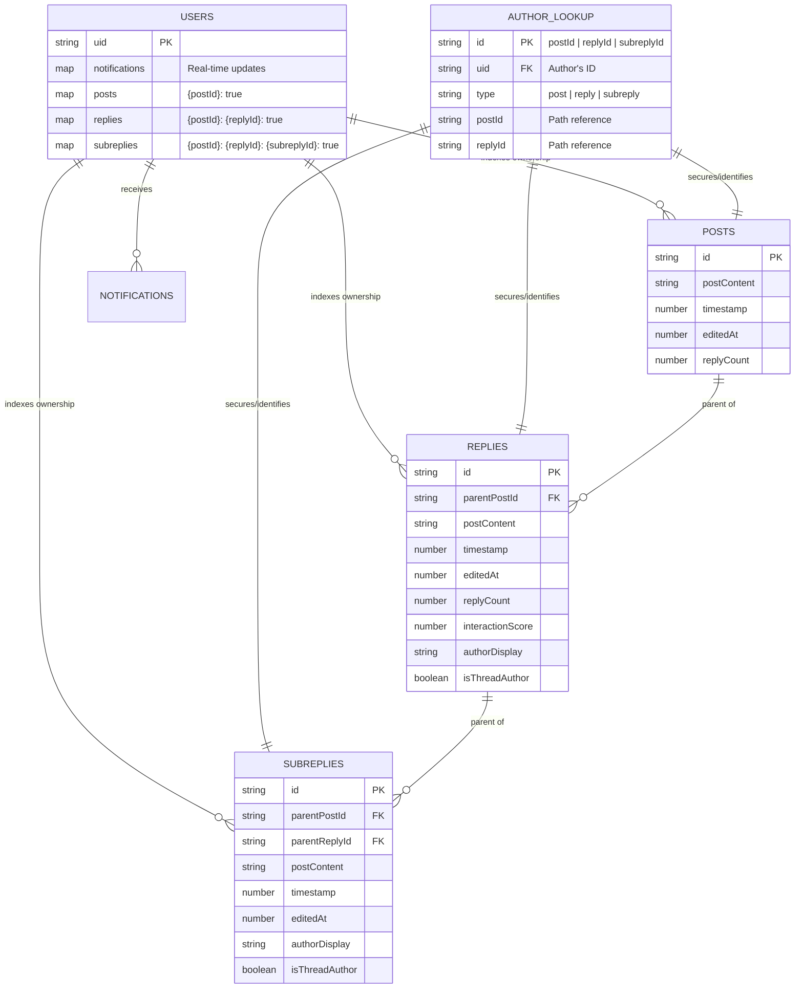

# The Open Dissent

> [!IMPORTANT]
> Anonymity is central to the values of TheOpenDissent. We encourage you to
> browse the source code, submit the feedback form on our website or use GitHub
> Issues to voice any concerns about anonymity (or anything else!).

## Development Setup

Install dependencies and start the frontend:

```sh
pnpm i # Install dependencies
```

In another terminal...

```sh
pnpm functions:watch # compile backend functions
```

In another terminal...

```sh
pnpm dev # start frontend
```

In yet another terminal...

```sh
# (first time only), USE THE FOLLOWING
pnpm emulate:new # start backend (local emulator dev environment)

pnpm emulate # start backend (local emulator dev environment)
```

Now access `localhost:4000` to see the database, cloud functions, authentication
and logs, and `localhost:5173` to see the frontend.

> [!WARNING]
> Make sure to quit the above processes in the same order that you started them
> so that the emulator can persist the database/auth data properly. Otherwise
> the `pnpm functions:watch` process may prevent the emulator from completing
> the export.

Hosting and the deployment of cloud functions/database security rules to
production is handled via GitHub Actions.

## Database Layout

We use a normalized Realtime Database structure to ensure high performance for threaded conversations, secure permissions and efficient data cleanup.

### Entity Relationship Diagram


```mermaid
erDiagram
    USERS ||--o{ POSTS : "indexes ownership"
    USERS ||--o{ REPLIES : "indexes ownership"
    USERS ||--o{ SUBREPLIES : "indexes ownership"
    USERS ||--o{ NOTIFICATIONS : "receives"

    AUTHOR_LOOKUP ||--|| POSTS : "secures/identifies"
    AUTHOR_LOOKUP ||--|| REPLIES : "secures/identifies"
    AUTHOR_LOOKUP ||--|| SUBREPLIES : "secures/identifies"

    POSTS ||--o{ REPLIES : "parent of"
    REPLIES ||--o{ SUBREPLIES : "parent of"

    USERS {
        string uid PK
        map notifications "Real-time updates"
        map posts "{postId}: true"
        map replies "{postId}: {replyId}: true"
        map subreplies "{postId}: {replyId}: {subreplyId}: true"
    }

    POSTS {
        string id PK
        string postContent
        number timestamp
        number editedAt
        number replyCount
    }

    REPLIES {
        string id PK
        string parentPostId FK
        string postContent
        number timestamp
        number editedAt
        number replyCount
        number interactionScore
        string authorDisplay
        boolean isThreadAuthor
    }

    SUBREPLIES {
        string id PK
        string parentPostId FK
        string parentReplyId FK
        string postContent
        number timestamp
        number editedAt
        string authorDisplay
        boolean isThreadAuthor
    }

    AUTHOR_LOOKUP {
        string id PK "postId | replyId | subreplyId"
        string uid FK "Author's ID"
        string type "post | reply | subreply"
        string postId "Path reference"
        string replyId "Path reference"
    }
```

### Path Schema

```
- authorLookup
  - {contentId}: Mapping for posts, replies, and subreplies
    - uid: string
    - type: "post" | "reply" | "subreply"
    - postId: string (if type is reply/subreply)
    - replyId: string (if type is subreply)

- posts
  - {postId}
    - id: string
    - postContent: string
    - timestamp: number
    - replyCount: number
    - editedAt?: number

- replies
  - {postId}
    - {replyId}
      - id: string
      - parentPostId: string
      - postContent: string
      - timestamp: number
      - replyCount: number
      - interactionScore: number (-3 to 3)
      - authorDisplay: string
      - isThreadAuthor: boolean
      - editedAt?: number

- subreplies
  - {postId}
    - {replyId}
      - {subReplyId}
        - id: string
        - parentPostId: string
        - parentReplyId: string
        - postContent: string
        - timestamp: number
        - authorDisplay: string
        - isThreadAuthor: boolean
        - editedAt?: number

- users
  - {uid}
    - notifications: { [id]: Notification }
    - posts: { [postId]: true }
    - replies: { [postId]: { [replyId]: true } }
    - subreplies: { [postId]: { [replyId]: { [subReplyId]: true } } }
```

### Why `authorLookup`?

To maintain a degree of "per-thread" anonymity, we do not store the author's
`uid` directly on the post or reply objects visible to other users. Security
rules use the private `authorLookup` table to verify that only the original
creator can edit or delete a piece of content, while keeping the `uid` hidden
from public `read` operations.

### Example JSON Structure

```JSON
{
  "authorLookup": {
    "post_999": {
      "uid": "user_123",
      "type": "post"
    },
    "reply_abc": {
      "uid": "user_456",
      "type": "reply",
      "postId": "post_999"
    }
  },
  "posts": {
    "post_999": {
      "id": "post_999",
      "postContent": "This is a top-level post.",
      "timestamp": 1714780000000,
      "replyCount": 1
    }
  },
  "replies": {
    "post_999": {
      "reply_abc": {
        "id": "reply_abc",
        "parentPostId": "post_999",
        "postContent": "I agree with this.",
        "timestamp": 1714780005000,
        "replyCount": 0,
        "interactionScore": 1,
        "authorDisplay": "Anonymous User",
        "isThreadAuthor": false
      }
    }
  }
}
```
